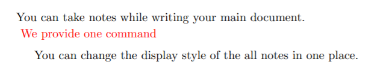
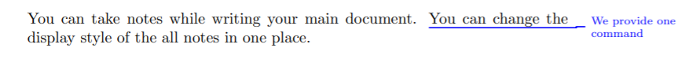
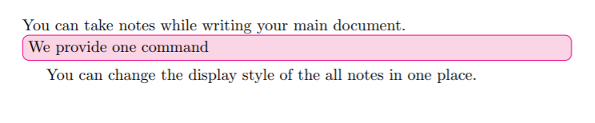
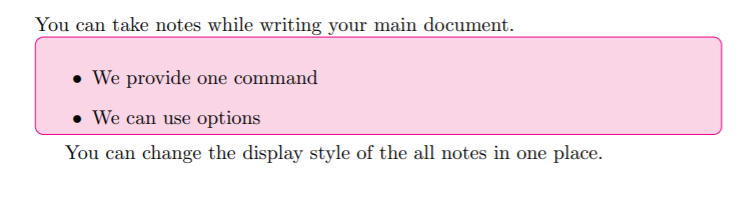
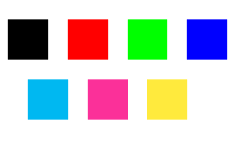

## purpose of this package

- You can take notes while writing your main document
- You can change the display style of the all notes in one place

## new command

We provide one command: ```\more{}```. You can write your notes in the curly braces of ```\more{}```, such as ```\more{this is a note}```

You can itemize in note, note is displayed in new line

## option

you should copy the file ```noteplus.sty``` to your work path or use CTAN

You can change the display style of notes by changing/adding package options, such as ```\usepackage[invisible, color=green]{notePlus}```

## example tex file and output

### default

main.tex

```tex
\documentclass[]{article}
\usepackage[utf8]{inputenc}
\usepackage[]{notePlus}
\title{test resume}
\begin{document}
\maketitle
\section{Introduction}
You can take notes while writing your main document.
\more{We provide one command}
You can change the display style of the all notes in one place.
\end{document}
```

pdf



### non-default

you can change style by replace ```\usepackage[]{notePlus}```

#### margin, color=blue, smaller

if you want the note placed at the margin with smaller font size and use blue as specific color, you should use ```\usepackage[margin, color=blue, smaller]{notePlus}```

```tex
\documentclass[]{article}
\usepackage[utf8]{inputenc}
\usepackage[margin, color=blue, smaller]{notePlus}
\title{test resume}
\begin{document}
\maketitle
\section{Introduction}
You can take notes while writing your main document.
\more{We provide one command}
You can change the display style of the all notes in one place.
\end{document}

```

pdf



#### backgroundColored, color=magenta

if you want the note placed at the margin with black text and colored background and use red as specific color, you should use ```\usepackage[backgroundColored, color=magenta]{notePlus}```

```tex
\documentclass[]{article}
\usepackage[utf8]{inputenc}
\usepackage[backgroundColored, color=magenta]{notePlus}
\title{test resume}
\begin{document}
\maketitle
\section{Introduction}
You can take notes while writing your main document.
\more{We provide one command}
You can change the display style of the all notes in one place.
\end{document}

```

pdf



#### backgroundColored, color=magenta, itemize

if you want the note placed at the margin with black text and colored background and use red as specific color, you should use ```\usepackage[backgroundColored, color=magenta]{notePlus}```

```tex
\documentclass[]{article}
\usepackage[utf8]{inputenc}
\usepackage[backgroundColored, color=magenta]{notePlus}
\title{test resume}
\begin{document}
\maketitle
\section{Introduction}
You can take notes while writing your main document.
\more{
\begin{itemize}
    \item We provide one command
    \item We can use options
\end{itemize}
}
You can change the display style of the all notes in one place.
\end{document}

```

pdf



## how to use options

### visible or invisible

- visible: Default, note is printed out
- invisible: note is hidden
  
Notes is visible by default, if you want to make the note invisible, you should override it by  ```\usepackage[invisible]{notePlus}```

### inline or margin

- inline: Default, note is inserted into page flow as another paragraph
- margin: note is printed at the right margin of page

Notes is inline by default, if you want to make the note margin, you should override it by  ```\usepackage[margin]{notePlus}```

### textColored or backgroundColored

- textColored: Default, note has custom color in its text, but its background is white, how the custom color can be configured is explained later
- backgroundColored: note has black text but its background has custom color

Notes is textColored by default, if you want to make the note backgroundColored, you should override it by  ```\usepackage[backgroundColored]{notePlus}```

### font size: small, smaller, smallest

- small: the font of notes is small
- smaller: the font of notes is smaller
- smallest: the font of notes is much smaller
  
Notes is normal size by default, if you want to make the note smaller, you should override it by  ```\usepackage[smaller]{notePlus}```

### custom color

feasible colors: black, red, green, blue, cyan, magenta, yellow



Notes is red by default, if you want to make the note blue, you should override it by  ```\usepackage[color=blue]{notePlus}```
